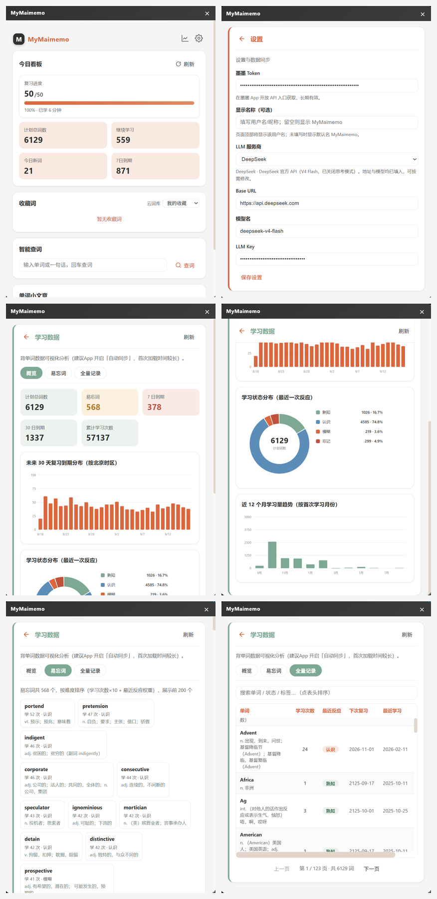

# MyMaimemo · 墨墨背单词浏览器插件

<p align="center">
  <strong>查词 · 看板 · AI 释义 · 单词故事 —— 四合一学习面板</strong>
</p>

<p align="center">
  <a href="#功能一览">功能</a> •
  <a href="#截图预览">截图</a> •
  <a href="#安装">安装</a> •
  <a href="#使用指南">使用</a> •
  <a href="#技术架构">架构</a>
</p>

---

## 功能一览

| 模块 | 说明 |
|------|------|
| **今日看板** | 一屏聚合：复习进度（完成/总数 + 进度条 + 百分比）、计划总词数、继续学习、7 日到期复习量 |
| **学习数据** | 全量学习记录可视化：复习到期分布 / 学习状态 / 月度趋势交互图表，易忘词与熟词清单，可搜索排序的全量记录表 |
| **收藏词管理** | 云词库下拉切换，实时显示当前词库的收藏词条；查词时自动收藏未背单词，并清理已背过的旧收藏 |
| **智能查词** | 输入单词或整句 → 有道词典（主）+ dictionaryapi.dev（备）→ 中文释义 / 音标 / 词性 / 双语例句 |
| **AI 释义** | 一键调用 LLM（DeepSeek / 智谱 GLM / 自定义 OpenAI 兼容），输出「音标 · 中文释义 · 英文释义 · 例句」四段式详解 |
| **单词小文章** | 基于「今日已背」词汇生成**逐句中英对照短文**，目标词汇绿色高亮，支持一键复制全文 |

---

## 截图预览

<div align="center">
  
</div>

| 位置 | 截图内容 | 说明 |
|------|----------|------|
| 左上 | **今日看板** | 复习进度、计划总词数、继续学习、7 日到期等 KPI 一览 |
| 右上 | **设置页** | 填写墨墨 Token、显示名称、选择 LLM 服务商并保存 |
| 左中 | **学习数据 · 概览** | 计划总词数、易忘词、到期量，以及未来 30 天复习到期分布 |
| 右中 | **学习数据 · 图表** | 学习状态分布环形图、近 12 个月学习量趋势 |
| 左下 | **学习数据 · 易忘词** | 按难度排序的高频易忘词卡片，展示学习次数与中文释义 |
| 右下 | **学习数据 · 全量记录** | 可搜索、排序、分页的全量学习记录表 |

---

## 安装

### 前置条件

- **Chrome**（推荐）或 **Edge** 浏览器
- 一个墨墨背单词账号（用于获取 Token）

### 加载步骤

1. 打开浏览器，地址栏输入 `chrome://extensions`（Edge 用户用 `edge://extensions`）
2. 右上角开启 **开发者模式**
3. 点击 **「加载已解压的扩展程序」**
4. 选择本仓库根目录 `MyMaimemoExtension`
5. 浏览器工具栏出现 **M** 图标 ✅

> 💡 **提示**：修改代码后需在扩展管理页点 **🔄 刷新图标** 才能生效。

---

## 使用指南

### 第一步：填写 Token

1. 点击面板右上角 **⚙ 齿轮图标** 进入设置
2. **墨墨 Token**：在墨墨 App 内获取：
   - 打开墨墨背单词 App → **更多设置** → **实验功能** → **开放 API**
   - 复制 Token 粘贴到输入框
3. 点击 **保存设置**

> Token 长期有效，无需频繁更换。

### 第二步：配置 LLM（可选）

填好 Token 即可查词和看板。如需 **AI 释义** 和 **单词故事**，还需配置 LLM：

| 服务商 | 默认 Base URL | 默认模型 |
|--------|--------------|---------|
| DeepSeek | `https://api.deepseek.com` | `deepseek-v4-flash` |
| 智谱 GLM | `https://open.bigmodel.cn/api/paas/v4` | `glm-4-flash` |
| 小米 memo (MiMo) | `https://api.xiaomimimo.com/v1` | `mimo-v2-flash` |
| opencode go | `https://opencode.ai/zen/go/v1` | `glm-5.2` |
| 自定义 | 任意 OpenAI 兼容端点 | 自由填写 |

- Base URL 支持两种写法：完整端点（含 `/chat/completions`）或前缀（含 `/v1`），均会正确拼接
- 插件已兼容推理模型（自动读取 `reasoning_content`）、多模态数组内容，同时发送 `max_tokens` 与 `max_completion_tokens`

### 第三步：开始使用

- **看板**：打开面板自动同步墨墨数据，点「刷新」手动更新
- **查词**：输入单词或句子 → 回车或点「查词」→ 自动收藏未背单词
- **AI 释义**：查词结果页点「✨ AI 释义」
- **单词故事**：页面底部点「📖 生成单词故事」→ 一键复制全文

---

## 目录结构

```
MyMaimemoExtension/
├── manifest.json          # Manifest V3 配置
├── popup.html             # 主面板页面（SPA 单文件）
├── background.js          # Service Worker
├── content.js / .css      # 注入脚本（悬浮按钮 + iframe）
├── css/
│   └── popup.css          # 面板样式（暗色主题变量 + 圆角卡片）
├── js/
│   ├── api.js             # 墨墨 OpenAPI 封装（进度/词本/学习记录/云词库）
│   ├── dict.js            # 多源词典（有道主 + dictionaryapi.dev 备）
│   ├── llm.js             # LLM 调用层（OpenAI 兼容协议）
│   └── popup.js           # 主逻辑（看板/查词/AI/故事/设置）
├── icons/                 # 扩展图标 (16/48/128)
└── screenshots/           # README 截图
```

---

## 技术架构

```
┌─────────────────────────────────────┐
│         Chrome Extension (MV3)       │
│                                     │
│  ┌──────────┐  ┌──────────────────┐ │
│  │content.js│─▶│  popup.html     │ │
│  │(注入按钮) │  │  (SPA 面板)       │ │
│  └──────────┘  └──────┬───────────┘ │
│                       │              │
│            ┌──────────▼──────────┐   │
│            │  js/api.js           │   │
│            │  ├─ maimemoFetch()   │──▶ open.maimemo.com
│            │  ├─ getStudyProgress │      (墨墨 OpenAPI)
│            │  ├─ listCloudNotepads│
│            │  └─ queryStudyRecords│   │
│            ├──────────────────────┤   │
│            │  js/dict.js          │──▶ dict.youdao.com
│            │  (有道词典主 + 备选)  │      api.dictionaryapi.dev
│            ├──────────────────────┤   │
│            │  js/llm.js           │──▶ 自定义 OpenAI 兼容
│            │  (DeepSeek/GLM/…)    │      端点
│            └──────────────────────┘   │
│                                     │
│  chrome.storage.local ▸◂ settings   │
└─────────────────────────────────────┘
```

**核心设计决策**：

- **Manifest V3**：Service Worker 替代 background page，符合 Chrome 最新标准
- **Content Script 注入**：通过 iframe 加载 popup.html，实现任意页面悬浮面板
- **数据缓存**：看板数据 5 分钟本地缓存，避免频繁请求墨墨 API
- **词典双源**：有道优先（中文释义质量高），dictionaryapi.dev 兜底
- **LLM 兼容层**：统一 OpenAI chat/completions 协议，支持推理模型和多模态响应

---

## 数据说明

| 数据项 | 来源 | 条件 |
|--------|------|------|
| 复习进度 / 继续学习 / 计划总词数 / 7日到期 | 墨墨学习接口 | App 需开启「自动同步」 |
| 学习数据（全量学习记录 / 状态 / 到期分布） | 墨墨学习记录接口 | App 需开启「自动同步」 |
| 收藏词列表 | 墨墨云词本 API | 需配置 Token |
| 词典释义 | 有道 / dictionaryapi.dev | 无需额外配置 |
| AI 释义 / 单词故事 | LLM API | 需配置 LLM Key |

---

## 开发 & 调试

```bash
# 1. 克隆仓库
git clone https://github.com/yifeigit/MyMaimemoExtension.git

# 2. 在 chrome://extensions 加载此目录

# 3. 修改代码后点扩展管理页的 🔄 刷新按钮

# 4. 面板内按 F12 打开 DevTools 调试
```

---

## License

MIT

---

<p align="center">
  Made with ❤️ for 墨墨背单词 users
</p>
